# HomeHunt 2.5 UI·화면 안내서

> 기준 버전: `2.5.0-handoff`
>
> 캡처 일자: 2026-09-04
>
> 캡처 환경: 로컬 서버 `http://127.0.0.1:8000/homehunt/`, 1146×912 데스크톱 뷰포트

이 문서는 HomeHunt를 처음 보는 사람과 다음 고도화 작업자가 현재 화면의 목적, 사용자 흐름, 화면에 표시되는 데이터의 의미를 빠르게 이해하도록 만든 화면 중심 안내서다. 캡처 속 결과는 샘플을 꾸민 것이 아니라 캡처 시점의 실제 로컬 저장 상태와 연결 상태다.

## 1. UI가 지향하는 것

HomeHunt는 보고서형 대시보드보다 **지도에서 후보를 좁히고, 필요한 순간에만 상세 정보를 여는 부동산 탐색 도구**를 지향한다.

- 집 찾기와 방문 기록 화면에서는 지도가 가장 넓고 먼저 보인다.
- 필터와 결과는 항상 펼쳐놓지 않고 버튼을 누르면 나오는 드로어·시트로 구성한다.
- 흰색과 밝은 중립색을 기본 표면으로 쓰고, 짙은 녹색은 선택 상태와 핵심 행동에만 쓴다.
- 사용자가 직접 저장한 정보와 외부 API가 확인한 정보를 시각적으로 구분한다.
- 가격은 `만원` 원자료를 그대로 노출하지 않고 `6억 5,000만원`처럼 읽을 수 있게 변환한다.
- 면적은 `㎡`와 `평`을 함께 보여준다. 평은 이해를 돕는 환산값이며 판정은 전용면적 `㎡`를 기준으로 한다.
- 연결 실패나 데이터 부족을 임의 숫자로 채우지 않는다. 상태와 다음 행동을 함께 안내한다.

### 시각 시스템

| 항목 | 현재 구현 |
|---|---|
| 기본 배경 | 흰색 중심, 지도 주변과 보조 패널에만 옅은 회색·민트 표면 |
| 핵심 색 | 부동산 서비스 느낌의 짙은 녹색 계열 |
| 글꼴 | Pretendard CDN |
| UI 기반 | Tabler Core 1.4.0 + Tabler Icons 3.46.0 |
| 지도 | NAVER Maps Web SDK |
| 카드 | 큰 라운드, 얇은 테두리, 약한 그림자 |
| 상세 정보 | 우측 드로어, 중앙 모달, 모바일 바텀시트 패턴 |
| 상태 피드백 | 로딩 문구, 스켈레톤/진행 상태, 성공·주의·오류 배너 |

Tabler는 버튼·폼·아이콘의 기초 일관성을 위해 사용하고, 실제 화면 배치와 지도 오버레이는 HomeHunt 전용 CSS로 구성한다. 네이버부동산의 **지도 우선, 필터는 부가 도구, 마커에서 결과로 진입**하는 사용 감각을 참고했지만 화면이나 상표를 그대로 복제하지는 않는다.

## 2. 전체 정보 구조

데스크톱 상단에는 핵심 메뉴를 숨기지 않고 모두 표시한다.

```text
HomeHunt
├─ 집 찾기       조건에 맞는 전체 후보를 지도에서 탐색
├─ 내 기록       실제로 방문한 집과 관심 후보를 관리
├─ 실거래        단지·전용면적별 계약 가격과 추세 확인
├─ 분양·청약     서울·경기 공급 공고 탐색과 조건 매칭
├─ 사용 안내     처음 쓰는 사람용 흐름과 용어 설명
└─ 연결 상태     외부 데이터·지도·경로 API 상태 점검
```

각 메뉴의 역할은 일부러 분리했다.

| 용어 | 의미 | 생성 시점 |
|---|---|---|
| 방향 제시 단지 | 공식 카탈로그에서 고른 초기 탐색용 단지. 아직 현재 조건을 통과한 추천이 아님 | 첫 화면 로드 |
| 검색 후보 | 조건 검색 뒤 가격·면적·연식 등 데이터가 판정된 단지 | 집 찾기 실행 |
| 관심 후보 | 사용자가 저장한 검색 후보 | `관심 저장` 선택 |
| 방문 기록 | 둘이 실제로 가 본 집의 당시 가격·평가·메모 | `집 기록하기` 저장 |
| 비교 후보 | 비교함에 담긴 기록 | 비교 선택 |
| 실거래 이력 | 국토부 신고 계약을 단지와 전용면적으로 묶은 결과 | 단지 실거래 조회 |
| 분양 공고 | LH·SH·청약홈 등 원천이 명시된 공급 정보 | 공급 수집 성공 시 |

따라서 **집 찾기에는 방문하지 않은 후보도 모두 나올 수 있고**, 방문했던 집은 지도와 목록에서 별표/방문 배지로 겹쳐 표시된다. 반대로 내 기록은 실제 방문 또는 사용자가 저장한 개인 기록을 중심으로 본다.

## 3. 공통 헤더와 반응형 동작

### 데스크톱

- 로고를 누르면 집 찾기로 돌아간다.
- 상단 중앙에 6개 메뉴를 모두 노출한다.
- 우측 `집 기록하기`는 어느 화면에서든 방문 기록 모달을 연다.
- 현재 메뉴는 흰색 또는 녹색 강조로 분명히 구분한다.

### 모바일

- 지도 가용 면적을 지키기 위해 자주 쓰는 메뉴는 하단 탐색 막대로 이동한다.
- 사용 안내와 연결 상태 같은 보조 메뉴는 상단 진입점을 유지한다.
- 필터·검색 결과·상세 정보는 화면을 덮는 드로어 또는 바텀시트로 열린다.
- 숫자 입력의 브라우저 스피너와 휠 변경을 막아 작은 화면에서 오입력을 줄였다.

현재 이 인수인계 폴더의 PNG는 데스크톱 캡처다. 모바일 배치는 CSS 계약 및 자동 테스트 대상이지만, 다음 고도화 단계에서는 390px와 430px 실제 화면 캡처를 다시 남기는 것을 권장한다.

## 4. 집 찾기

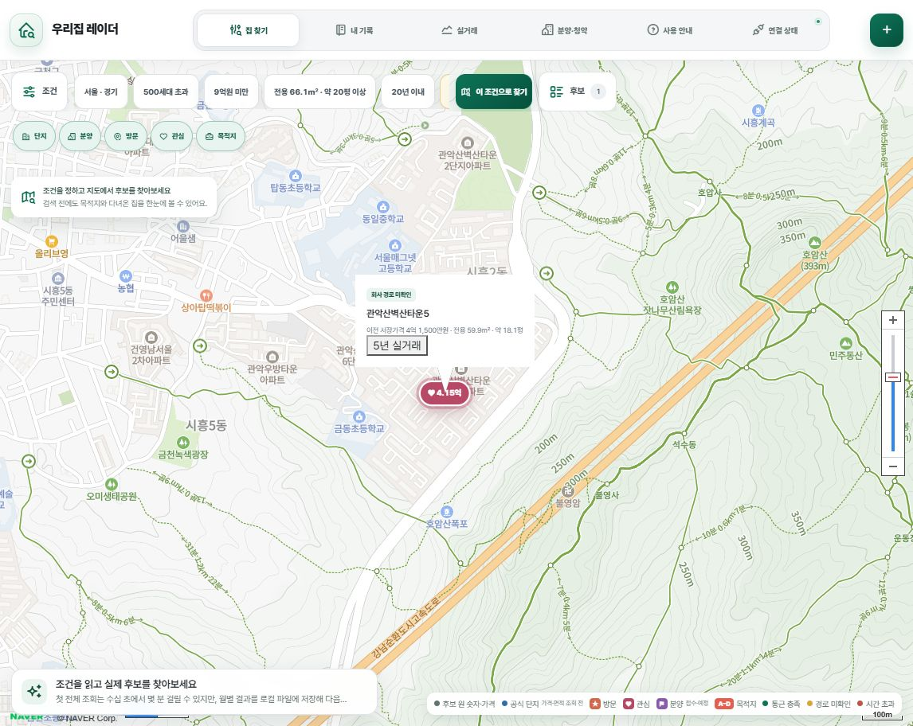

### 화면 목적

사용자가 원하는 가격·면적·세대수·연식·교통 조건을 입력하면, 서울·경기 공식 아파트 중 조건을 판정할 수 있는 후보를 찾고 지도와 목록에서 함께 살펴보는 핵심 화면이다. 방문한 집만 보여주는 화면이 아니다.

### 기본 화면 구성

1. **상단 검색·행동 영역**
   - 지역/단지명을 빠르게 찾는다.
   - `조건` 버튼은 상세 필터를 연다.
   - `결과` 버튼은 현재 검색 결과 목록을 연다.
2. **지도 레이어 버튼**
   - 아파트, 분양, 관심, 방문, 회사 위치 등 필요한 종류를 켜고 끈다.
3. **지도 마커와 클러스터**
   - 확대 수준에 따라 인접 후보를 숫자가 든 원으로 묶는다.
   - 확대하면 개별 단지 가격 핀으로 풀린다.
4. **회사/목적지 핀**
   - 회사가 여러 곳이면 각각의 목적지로 저장하고 균형 통근을 계산한다.
5. **하단 또는 우측 결과 시트**
   - 지도에서 고른 후보의 핵심 정보와 다음 행동을 제공한다.

첫 진입 시 보이는 일부 핀은 전국 카탈로그 전체를 추천한 것이 아니라, 화면이 비어 보이지 않도록 방향을 제시하는 공식 단지다. 실제 추천은 조건 검색을 수행하고 가격·면적·연식 및 교통 검증 상태를 판정한 뒤 생성된다.

### 필터 드로어

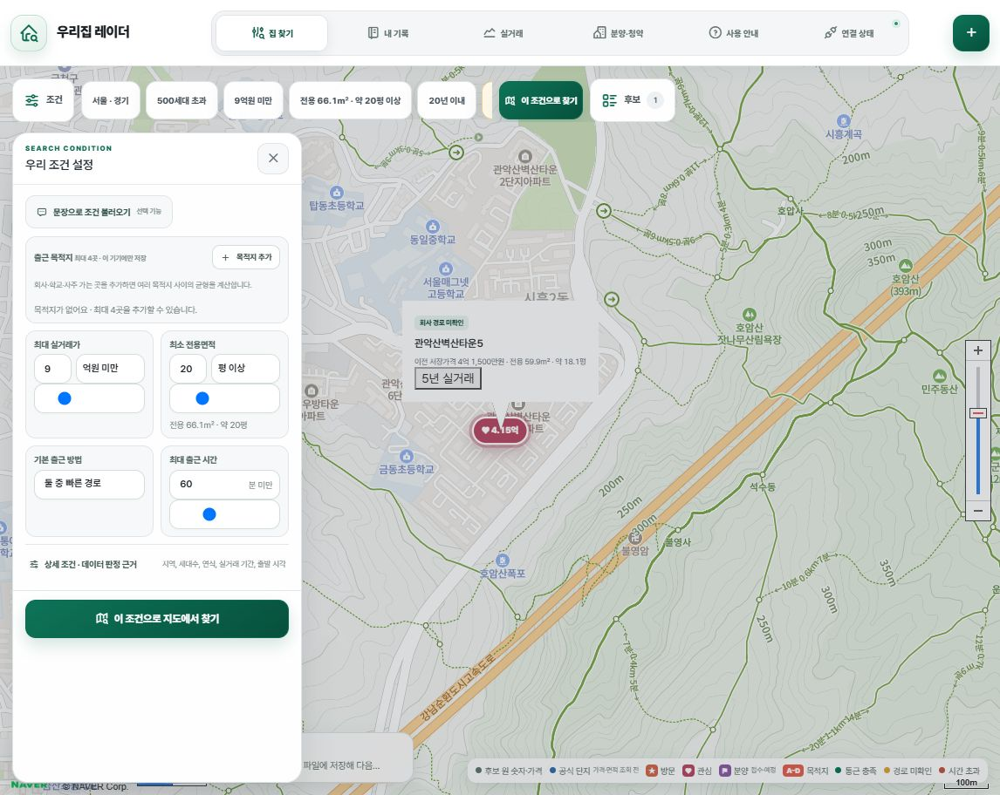

필터는 지도를 가리지 않도록 기본적으로 닫혀 있다. 현재 다루는 주요 조건은 다음과 같다.

- 서울/경기와 세부 지역
- 최대 실거래 가격
- 최소 전용면적 또는 최소 평형
- 최소 세대수
- 최대 연식
- 역까지 희망 도보 시간
- 회사별 최대 통근 시간
- 자동차·대중교통 등 이동 수단
- 매매/전세 등 거래 유형
- 기존 아파트와 분양 공고 표시 여부

일부 값은 슬라이더나 프리셋으로 빠르게 조정하고, 정확한 숫자가 필요할 때만 직접 입력하게 설계한다. 조건을 바꾸는 동안 기존 검색 결과가 새 조건의 결과처럼 남지 않도록 사전검사 실패 시 이전 결과를 비운다.

### 결과 시트

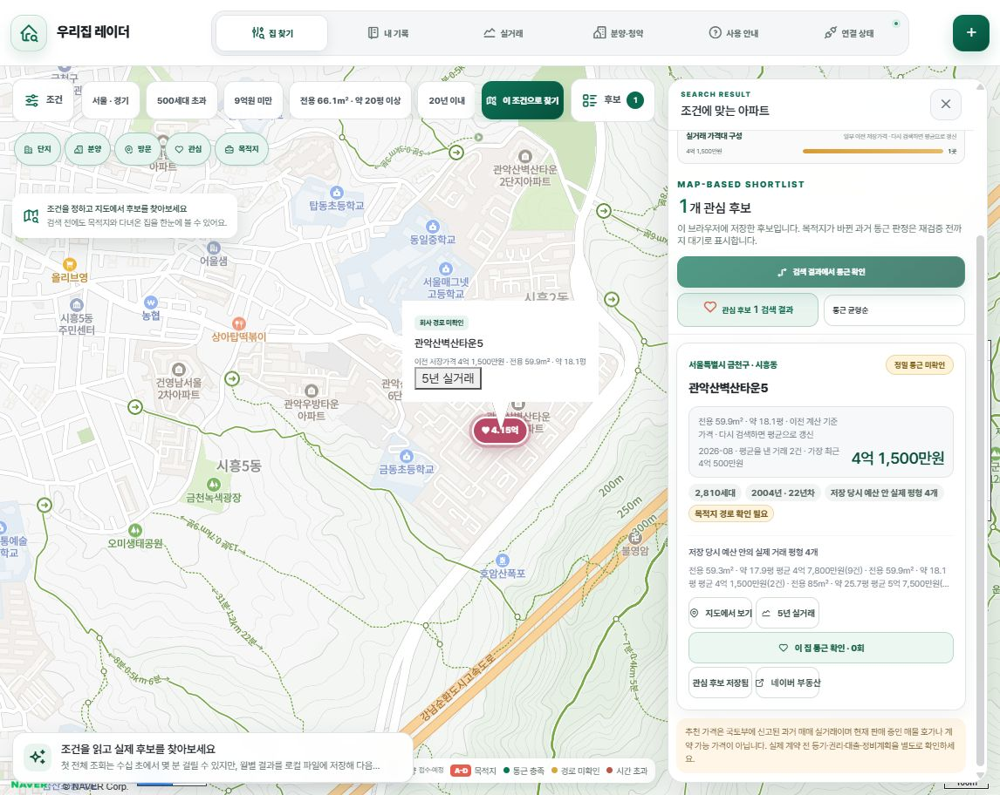

후보 한 건에는 가능한 범위에서 다음 정보가 붙는다.

- 단지명과 주소
- 최근 실거래 가격과 거래 시점
- 전용면적 `㎡`와 약식 `평`
- 세대수와 준공연도/연식
- 조건별 통과·미확인·초과 상태
- 회사까지 직선거리와 실제 경로 검증 상태
- 관심 저장, 방문 기록, 실거래 보기, 비교 행동

결과가 0건일 때는 단순히 `없음`으로 끝내지 않고 가격, 지역, 교통, 데이터 부족 중 어느 조건이 병목인지 보여주는 것이 현재와 다음 버전의 중요한 원칙이다.

### 집 찾기 상태 흐름

```text
조건 입력
  → 지역·가격·면적·세대수·연식으로 1차 후보 생성
  → 좌표 보강 및 목적지와의 거리순 정렬
  → 실제 경로 제공자가 있으면 통근시간 검증
  → 검증된 후보만 기본 추천에 표시
  → 사용자가 관심 저장 / 방문 기록 / 실거래 조회
```

통근 경로를 확인하지 못한 후보는 `1시간 이내`로 간주하지 않는다. 특히 넓은 조건에서 후보가 600건을 넘으면 임의로 앞부분만 추천하지 않고 조건 축소 또는 검증 범위 변경을 안내한다.

## 5. 내 기록

### 목록 보기

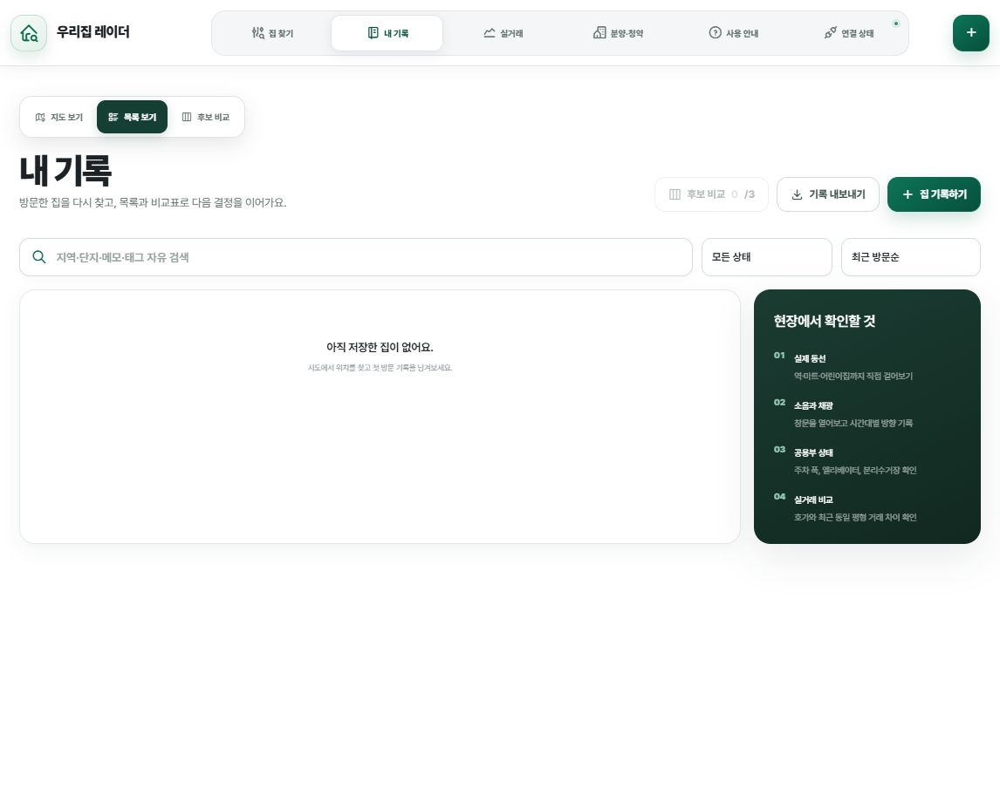

내 기록은 둘이 실제로 다녀온 집의 당시 상황과 감상을 남기는 개인 공간이다. 캡처 시점에는 저장된 방문 기록이 없어 빈 상태가 정확히 표시된다.

방문 기록에는 다음을 저장할 수 있다.

- 단지명과 주소/지도 좌표
- 방문일
- 매매·전세·월세 구분
- 당시 확인 가격
- 전용면적, 층, 동/호 등 선택 정보
- 성우와 소희 각각의 평가
- 장점·단점·메모
- 관심 상태와 결정 상태

목록에서는 방문 집을 정렬·필터하고, 카드에서 즉시 `지도 보기`, `실거래 보기`, `비교`로 이동한다. 실제 실거래가 연결되면 방문 당시 확인 가격과 현재 또는 최근 신고 가격의 차이를 보여준다.

### 지도 보기

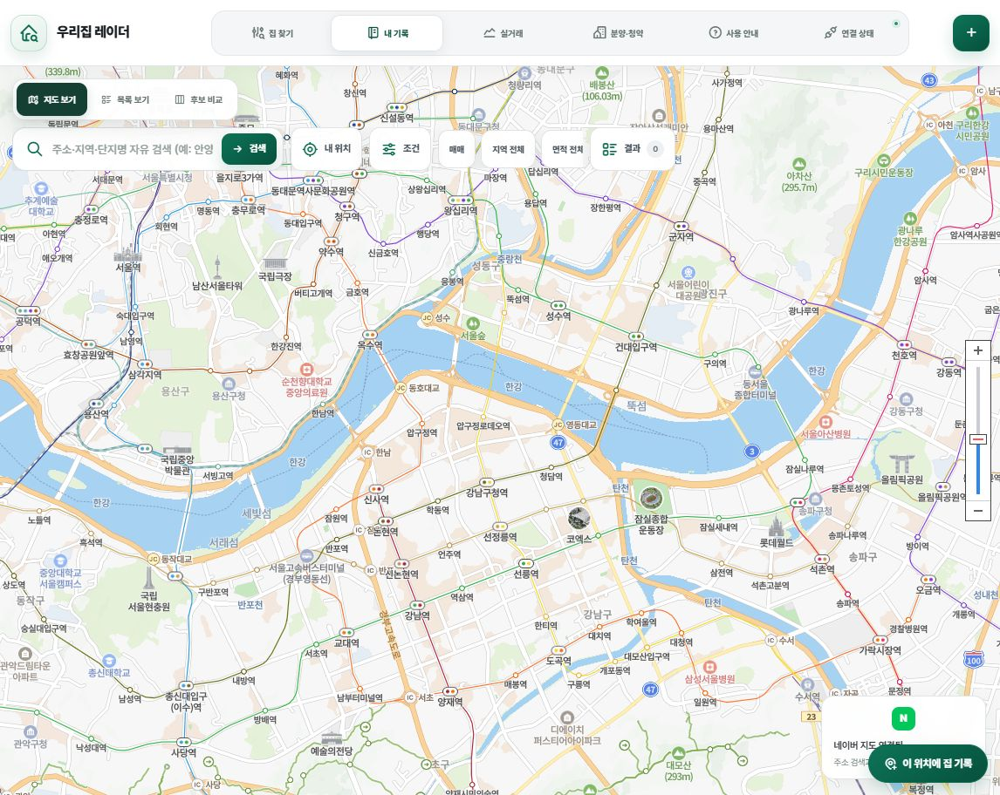

지도 보기에서는 방문 핀과 관심 후보를 공간적으로 비교한다. 집 찾기와 달리 목적은 신규 후보 발굴보다 **우리의 행동 이력 회고**다. 기록을 선택하면 당시 메모와 현재 가격 변화가 연결된다.

### 방문 기록 모달

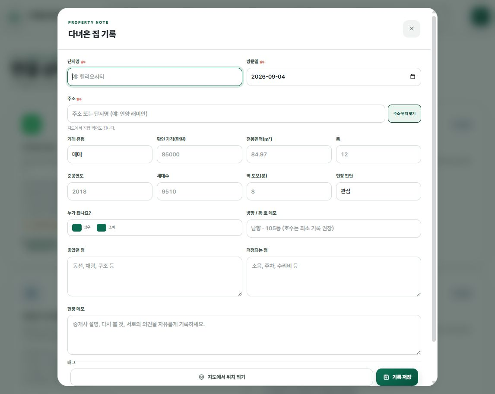

상단 `집 기록하기`로 여는 전역 모달이다. 검색 결과나 지도에서 열면 단지명·주소·좌표를 이어받고, 직접 열면 사용자가 새 위치를 찾는다. 저장 정보는 현재 브라우저 로컬 저장소에 보관되므로 같은 기기·브라우저에서만 자동 유지된다.

## 6. 실거래

### 단지 실거래 이력

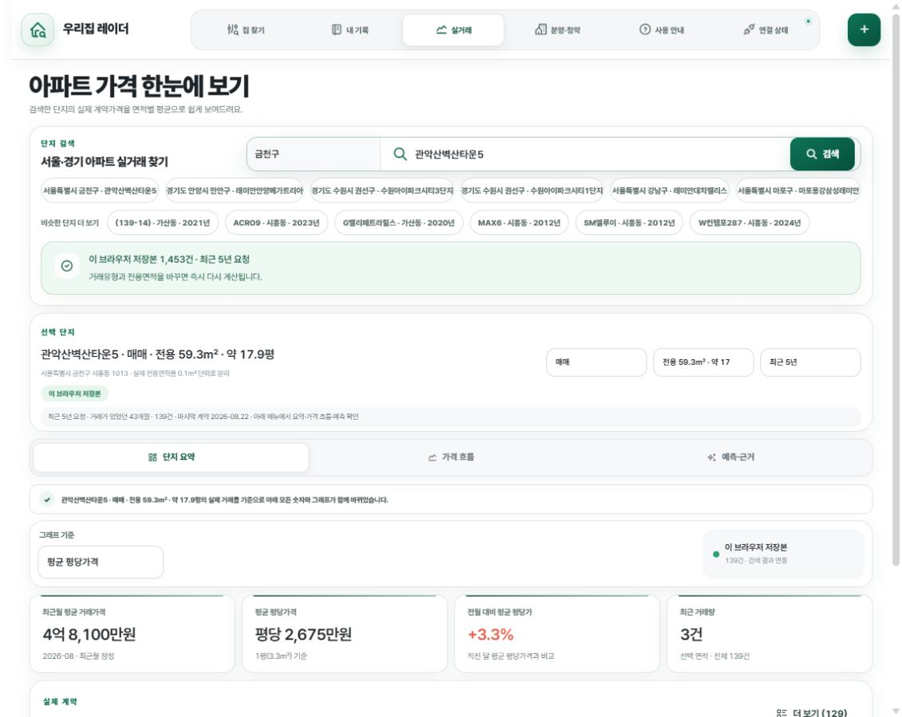

국토부 실거래가 API의 신고 계약을 단지별로 조회한다. 같은 단지라도 크기에 따라 가격 차이가 크므로 **전용면적을 0.1㎡ 단위의 실제 면적으로 구분**하고, 선택한 면적의 거래만 차트와 요약에 사용한다.

주요 조작은 다음과 같다.

- 단지명·주소·동네 검색
- 매매/전월세 전환
- 실제 존재하는 전용면적 선택
- 최근 1년/3년/5년 기간 전환
- 개별 계약 점과 월별 평균 흐름 확인
- 최근 거래 목록 열기
- 집 찾기 또는 내 기록에서 선택한 단지 바로 이어보기

가격 요약은 사용자가 익숙한 **평균 가격**을 전면에 쓴다. 극단값의 영향을 덜 받는 중간값을 내부 품질 판정에 활용할 수는 있지만, 화면에는 의미를 설명하지 않은 `중위` 용어를 핵심 숫자로 쓰지 않는다.

### 예상 가격과 근거

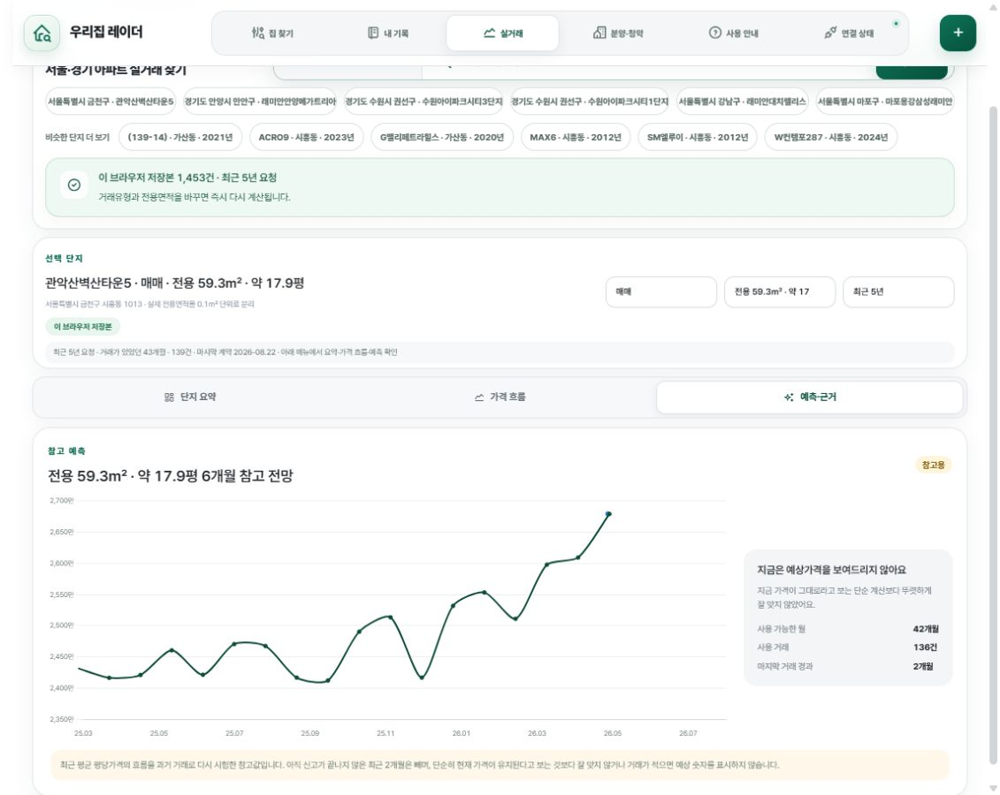

예상은 항상 나오지 않는다. 현재 구현은 과거 월별 단가의 시간 순서 추세를 계산하고 롤링 백테스트로 과거 구간을 얼마나 잘 맞혔는지 점검한다. 다음 중 하나라도 부족하면 숫자를 감추고 `지금은 예상가격을 보여드리지 않아요`라고 표시한다.

- 거래 기간과 월별 관측치가 충분한가
- 최근 신고 진행월을 제외해도 자료가 충분한가
- 한두 건의 이상 거래가 전체 흐름을 지배하지 않는가
- 백테스트 오차가 허용 범위 안인가
- 과거 구간을 포함하는 비율과 거래 밀도가 충분한가

캡처 속 단지는 42개월·136건의 이력이 있었지만 품질 게이트를 통과하지 못해 예상값을 보류한 상태다. 이 보류는 오류가 아니라 **과신을 막는 정상 동작**이다.

## 7. 분양·청약

### 분양 공고 목록

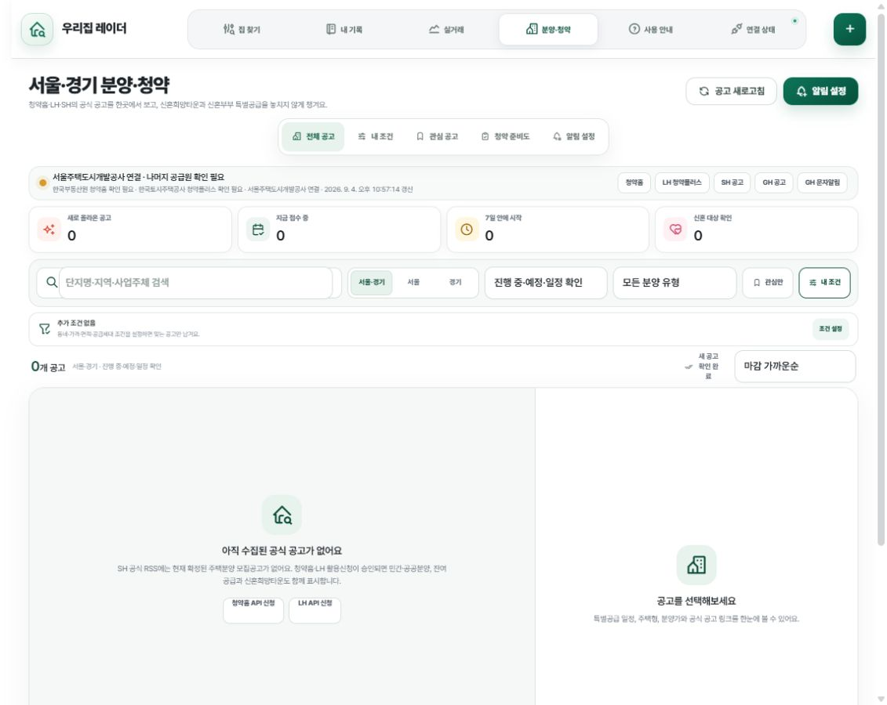

서울·경기의 공공 및 민간 분양, 신혼희망타운, 신혼부부 특별공급 등 원천이 확인된 공고를 모아보는 화면이다.

화면 구성은 다음과 같다.

- 공급 유형·지역·입주자 조건 필터
- 내 조건에 맞는 공고만 보기
- 관심 공고 저장
- 접수 예정/접수 중/마감 상태
- 지도 레이어로 위치 확인
- 공식 공고 원문 이동
- 청약 준비도와 알림 설정 진입

캡처 시점에는 공식 공급 피드가 0건이다. 승인 대기 또는 원천 수집이 완료되지 않은 상태를 샘플 공고로 채우지 않고 빈 상태와 연결 안내를 보여준다.

### 분양 조건 맞춤 모달

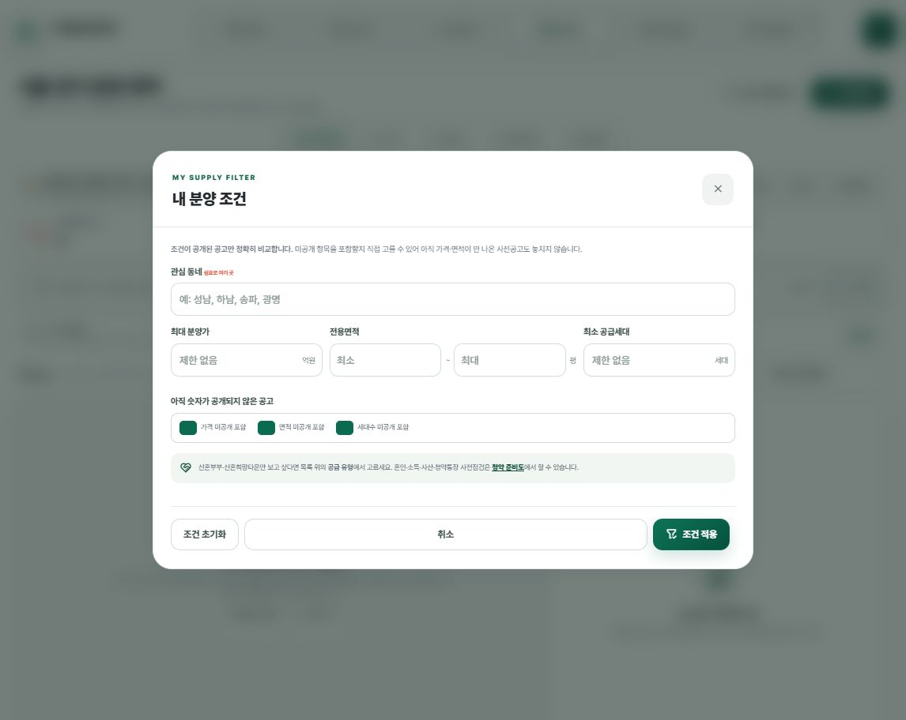

두 사람의 상황과 희망 조건을 저장하고 공고를 선별하는 곳이다. 희망 지역·예산·주택 유형 같은 선택 조건과 함께 신혼 기간, 무주택 여부, 청약통장 등 자격 판정에 필요한 정보를 입력한다.

`당첨 확률`은 개인별 경쟁률·가점·추첨 배정 자료가 충분하지 않으면 만들지 않는다. 대신 현재 확인 가능한 항목으로 다음을 구분한다.

- 명백히 충족하는 조건
- 추가 서류/공고 확인이 필요한 조건
- 현재 입력으로는 판단할 수 없는 조건
- 신청 전에 준비할 항목

### 청약 준비도

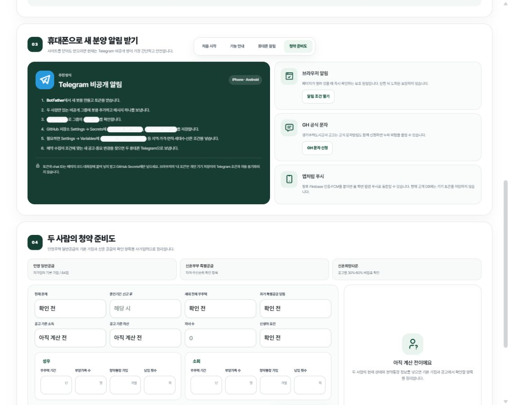

청약 준비도는 확률 예언이 아니라 신청 준비 체크리스트다. 입력 완성도와 공고 자격 조건을 바탕으로 누락 정보를 찾아주며, 법적·행정적 최종 판단은 반드시 공식 공고문을 기준으로 한다.

## 8. 사용 안내

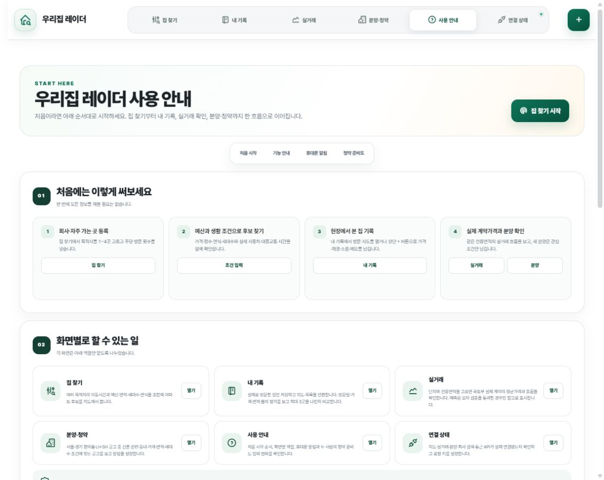

처음 들어온 사람이 메뉴 이름만 보고도 다음 행동을 선택할 수 있도록 만든 내장 설명서다.

- 빠른 시작 순서
- 여섯 메뉴의 역할
- 실거래·예상·통근 정보의 의미
- 개인정보와 로컬 저장 주의사항
- 연결이 안 될 때 확인할 곳

이 인수인계 작업에서 예전 메뉴명으로 남아 있던 안내 문구를 현재의 `내 기록`, `분양·청약` 정보 구조에 맞춰 정리했다.

## 9. 연결 상태

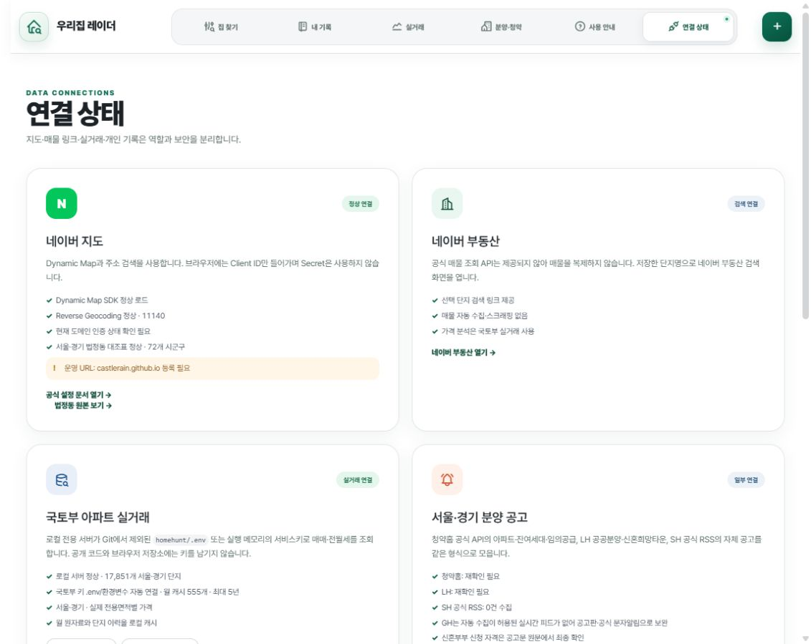

지도나 검색 결과가 비어 있을 때 사용자가 사이트 고장과 데이터 미연결을 구분할 수 있게 하는 진단 화면이다.

주요 상태는 다음과 같다.

- 로컬 실거래 서버 버전
- 국토부 매매/전월세 API
- NAVER 지도 SDK
- NAVER 주소·장소 검색
- NAVER 자동차 길찾기
- TMAP 대중교통 경로
- Kakao 대체 경로
- 공식 아파트 카탈로그 수와 기준일
- 분양 원천별 수집 상태

API 키의 실제 값은 화면, 문서, 저장소에 노출하지 않는다. 환경 변수 이름과 설정 여부만 표시한다.

## 10. 다중 목적지 입력

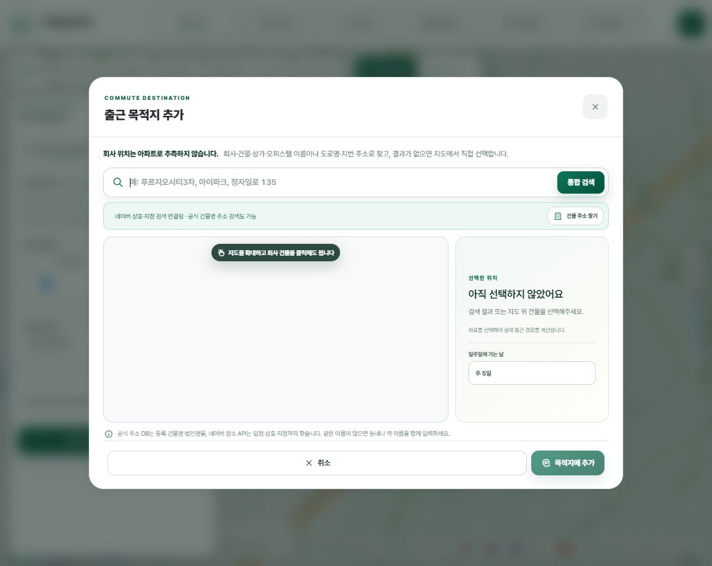

회사 한 곳만 기준으로 집을 찾지 않고 성우·소희의 회사 또는 자주 가는 장소 3~4곳을 저장할 수 있다.

입력 흐름은 다음과 같다.

1. 회사명, 건물명, 도로명 또는 지번 일부를 검색한다.
2. 장소 검색 후보에서 정확한 결과를 선택한다.
3. 검색이 어렵다면 지도에서 직접 건물을 찍는다.
4. 이름과 좌표를 저장하고 목적지별 허용 시간을 정한다.
5. 추천에서는 한 명에게만 유리한 후보가 되지 않도록 최악 시간, 평균 시간, 균형 점수를 함께 본다.

회사 검색은 아파트 목록 검색과 분리되어 있으며, NAVER 지역 검색/지오코딩을 통해 일반 회사·상가·공공기관·건물도 찾는 구조다. 공식 주소의 건물명이 입주 회사명과 다를 수 있으므로 검색 결과 주소와 지도 위치를 마지막에 확인해야 한다.

## 11. 처음 사용하는 사람의 권장 순서

```text
1. 연결 상태에서 지도·국토부·장소 검색 상태 확인
2. 집 찾기에서 회사 또는 주요 목적지 저장
3. 가격·면적·세대수·연식 조건 설정
4. 검색 실행 후 지도 클러스터와 결과 목록 확인
5. 후보를 관심 저장하거나 실거래 화면으로 이동
6. 실제 방문 뒤 내 기록에 당시 가격과 메모 저장
7. 시간이 지난 뒤 방문 당시 가격과 최신 실거래 변화 확인
8. 분양·청약에서 별도의 희망 조건과 준비도 설정
```

## 12. 주요 소스 파일 지도

| 영역 | 파일 | 역할 |
|---|---|---|
| HTML 골격·모달 | `homehunt/index.html` | 6개 화면, 공통 헤더, 입력 폼, 접근성 레이블 |
| 전체 화면 동작 | `homehunt/js/app.js` | 화면 전환, 검색, 추천, 실거래, 기록, 분양 렌더링 |
| 지도 | `homehunt/js/naver-map.js` | NAVER SDK 초기화, 마커·클러스터·지도 선택 |
| 저장 | `homehunt/js/storage.js` | 방문 기록·관심 후보·환경 설정 로컬 저장 |
| UI 공통 | `homehunt/js/ui-kit.js` | 토스트, 상태 표시, 공통 상호작용 |
| 내비게이션 | `homehunt/js/navigation-v25.js` | 6개 메뉴와 모바일 이동 |
| 추천 판정 | `homehunt/js/recommendation-core.mjs` | 가격·면적·세대수·연식 등 순수 판정 |
| 검증 상태 | `homehunt/js/recommendation-verification-core.mjs` | 통과·미확인·초과 상태 분리 |
| 다중 목적지 | `homehunt/js/commute-balance-core.mjs` | 목적지별 시간과 균형 점수 |
| 실거래 계산 | `homehunt/js/market-core.mjs` | 면적 그룹, 평균, 추세, 예측 품질 게이트 |
| 분양 | `homehunt/js/supply-core.mjs` | 공고 정규화, 필터, 매칭, 상태 계산 |
| 청약 준비 | `homehunt/js/subscription-readiness-core.mjs` | 입력 완성도와 준비 항목 산출 |
| 서버 | `homehunt/scripts/local-market-server.mjs` | 비밀키 보관, 외부 API 프록시, 캐시, 검색·추천 응답 |
| 기본 스타일 | `homehunt/css/styles.css` | 기존 화면·지도·반응형 스타일 |
| UI 레이어 | `homehunt/css/ui-kit.css` | Tabler 위의 HomeHunt 디자인 토큰과 컴포넌트 |
| 2.5 내비 | `homehunt/css/navigation-v25.css` | 고정 헤더와 모바일 내비 |
| 분양 화면 | `homehunt/css/supply.css` | 분양 카드·상세·필터·준비도 |
| 안내 화면 | `homehunt/css/guide.css` | 사용 안내 전용 레이아웃 |

`app.js`가 큰 단일 오케스트레이션 파일로 남아 있는 것은 다음 고도화에서 가장 먼저 분리해볼 구조적 과제다. 순수 계산은 이미 `.mjs` 코어 모듈로 분리되어 있어 UI 상태 관리와 화면별 컨트롤러를 단계적으로 나누기 쉽다.

## 13. 화면 검수 체크리스트

- 메뉴 여섯 개가 데스크톱에서 숨김 없이 보이는가
- 집 찾기 첫 화면에서 지도가 필터보다 넓게 보이는가
- 필터를 닫았을 때 지도 조작을 방해하지 않는가
- 검색 중 진행 상태가 보여 사이트가 멈춘 것처럼 느껴지지 않는가
- 클러스터 숫자와 결과 건수가 같은 검색 상태를 가리키는가
- 관심, 방문, 분양 마커를 시각적으로 구분할 수 있는가
- 카드 가격이 모두 `억·만원` 형식으로 읽히는가
- 전용면적에 `㎡`와 `평`이 함께 보이는가
- 통근 미확인이 `시간 충족`으로 표시되지 않는가
- 예상 품질이 낮을 때 숫자를 감추는가
- 빈 데이터가 샘플 데이터로 오인되지 않는가
- 목록 카드에서 실거래 화면으로 맥락을 유지한 채 이동하는가
- 키보드 포커스, 모달 닫기, 배경 스크롤 잠금이 정상인가
- 390px 화면에서 가로 스크롤이 생기지 않는가
